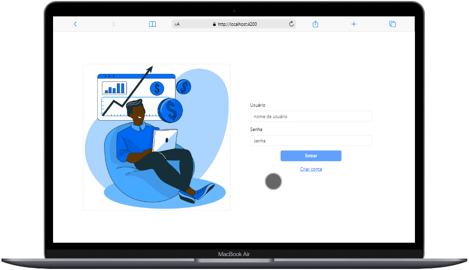

<div align="center" id="top"> 
  

&#xa0;

  <!-- <a href="https://atospersonalfinance.netlify.com">Demo</a> -->
</div>

<h1 align="center">Atos Personal Finance</h1>

<p align="center">
  

  

  

  
</p>

<p align="center">
  <a href="#dart-sobre">Sobre</a> &#xa0; | &#xa0; 
  <a href="#sparkles-funcionalidades">Funcionalidades</a> &#xa0; | &#xa0;
  <a href="#rocket-tecnologias">Tecnologias</a> &#xa0; | &#xa0;
  <a href="#white_check_mark-pré-requisitos">Pré requisitos</a> &#xa0; | &#xa0;
  <a href="#checkered_flag-começando">Começando</a> &#xa0; | &#xa0;
  <a href="#memo-licença">Licença</a> &#xa0; | &#xa0;
  <a href="https://github.com/kacyos" target="_blank">Autor</a>
</p>
<br>

## :dart: Sobre

Personal finance é uma aplicação desenvolvida em Angular para auxiliar no gerenciamento das finanças pessoais de forma prática e eficiente. Com esta ferramenta, você poderá acompanhar suas receitas e despesas e visualizar o balanço, e manter suas finanças sob controle.

## :sparkles: Funcionalidades

:heavy_check_mark: **Cadastro de Transações**: Registre suas receitas e despesas de forma simples e rápida.
:heavy_check_mark: **Categorização**: Dê uma categoria para suas transações.
:heavy_check_mark: **Acompanhamento de Saldo**: Visualize o total de entradas, saídas e o balanço.
:heavy_check_mark: **Cadastrou errado?**: Edite ou exclua transações.
:heavy_check_mark: **Geração de relatório**: Gere relatório de receitas e despesas

## :rocket: Tecnologias

As seguintes ferramentas foram usadas na construção do projeto:

- [Angular](https://angular.io/)
- [Bootstrap](https://getbootstrap.com/)
- [TypeScript](https://www.typescriptlang.org/)

## :white_check_mark: Pré requisitos

Antes de começar :checkered_flag:, você precisa ter o [Git](https://git-scm.com), [Node](https://nodejs.org/en/) e o [AngularCLI](https://angular.io/cli) instalados em sua maquina.

## :checkered_flag: Começando

```bash
# Clone este repositório
$ git clone https://github.com/kacyos/AtosPersonalFinance

# Entre na pasta
$ cd AtosPersonalFinance

# Instale as dependências
$ npm install

# Para iniciar o projeto
$ ng serve

# O app vai inicializar em < http://localhost:4200/>
```

## :memo: Licença

Este projeto está sob licença MIT. Veja o arquivo [LICENSE](LICENSE.md) para mais detalhes.

Feito com :heart: por <a href="https://github.com/kacyos" target="_blank">Cacio de Castro</a>

&#xa0;

<a href="#top">Voltar para o topo</a>
